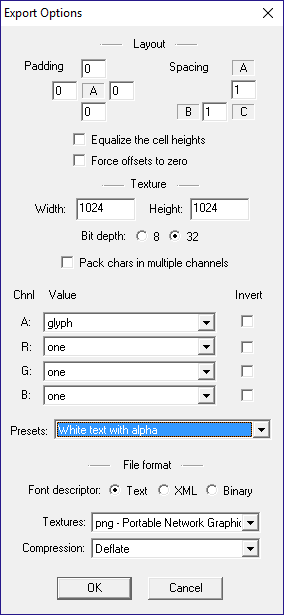
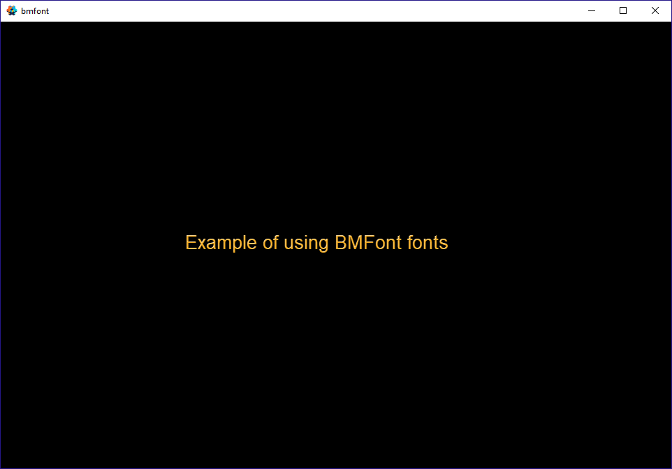

# BMFont example

This shows general setup for using BMFont generated fonts.

http://www.angelcode.com/products/bmfont/

You must make sure the exported texture is large enough to fit all glyphs as Defold doesn't support paged textures for fonts. Also check to see how much extra space you have in your texture and pick a smaller size. The width/height should be powers of 2, but they do not have to be an even size. You could have a texture 1024x256 for example.

If you change the texture of the bmfont export you must swap fonts in the .font file to see it update in engine. (This bug has been reported.)

You can customize the look of your fonts more by making copies of the font materials and using them instead. In the demo, the label in main.collection has a redish color, but because the custom material ignores this it only draws the actual texture of the font. The custom material does still use the alpha of the color so you could test changing that to see.

The materials you are looking for have a fnt at the end.

If you want some text effects you'll need to add extra padding to add enough area around each font glyph.

If you want to use BMFont for counters then you may want to make small fonts with only numeric glyphs and then enable "Equalize the cell heights" / "Force offsets to zero" in the Export Options. Otherwise your counters may look odd as they increase / decrease. Make sure you position at pixel perfect positions when using pixel fonts. Experiment and see what works.

